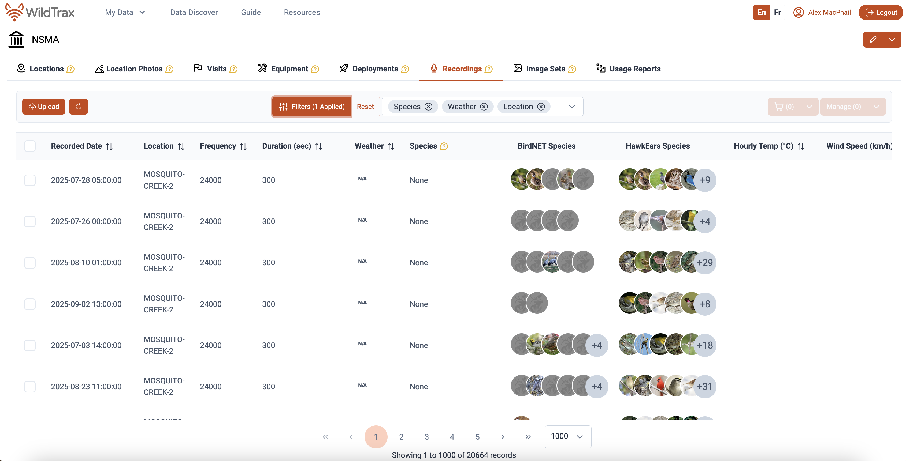
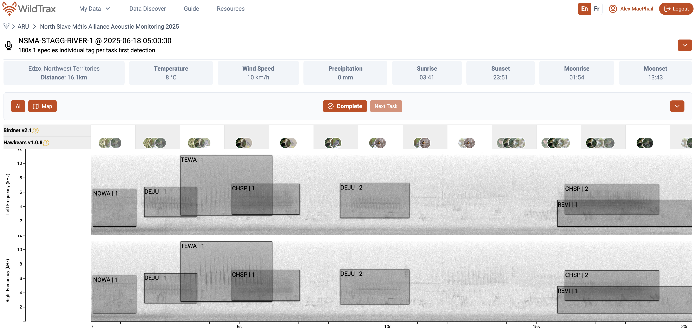

```{r}
#| label: load-packages and authenticate
#| include: false
#| echo: false
#| eval: true
#| warning: false
#| message: false

library(tidyverse)
library(leaflet)
library(wildrtrax)
library(sf)
library(ggridges)
library(kableExtra)
library(plotly)
library(DT)
library(vegan)

#wt_auth()

load('nsma.RData')
#save.image('nsma.RData')
```

# Abstract

The North Slave Métis Alliance deployed Autonomous Recording Units (ARUs) across `r nrow(locs_summary)` locations over three years to characterize the acoustic community. This project is part of a broader community-based monitoring initiative under the NSMA Guardianship Program, which incorporates game cameras, ARUs, water quality sampling, and eDNA to assess biodiversity in the North Slave Region. A total of `r nrow(distinct_spp)` species were detected, `r nsma_sar |> select(species_common_name) |> distinct() |> nrow()` species-at-risk, with species accumulation beginning to stabilize as more locations were surveyed. These results highlight the effectiveness of ARUs in detecting species and their potential to enhance the overall North Slave species monitoring programs. Continued long-term sampling of sites already surveyed, along with the inclusion of new locations in areas that reflect the dynamic northern landscape, is recommended to sustain and improve monitoring efforts.

::: {.callout-note collapse="true" style="background-color: #f4f4f4; padding: 20px;"}
This report is dynamically generated, meaning its results may evolve with the addition of new data or further analyses. For the most recent updates, refer to the publication date and feel free to reach out to the authors.
:::

```{r Data download}
#| warning: false
#| message: false
#| echo: false
#| eval: false
#| include: true
#| code-fold: false

# Download data from WildTrax
nsma_projects <- wildrtrax::wt_get_projects(sensor = 'ARU') |>
  filter(grepl('^North Slave', project)) |>
  select(project_id) |>
  pull()

nsma_main <-
  map_dfr(
    .x = nsma_projects,
    .f = ~ wildrtrax::wt_download_report(
      project_id = .x,
      sensor_id = "ARU",
      reports = "main"
    )
  )
```

# Land Acknowledgement

We acknowledge the traditional lands and territories of the North Slave Métis Alliance (NSMA), whose members trace their origins to the early unions of French fur-traders and Indigenous women of the Great Slave Lake region. The Métis of this area have long existed as a distinct and vibrant community, exercising their harvesting rights across the Northwest Territories and beyond. We honour their continued stewardship of these lands and their rights recognized under section 35(1) of the Constitution Act, 1982.

# Introduction

Human activities have been identified as key pressures and contributors to the global decline in forest wildlife (@allan2017recent). The repercussions of habitat fragmentation (@fahrig2003effects) and loss (@hanski2011habitat), climate change (@mantyka2012interactions, @sattar2021review, @abrahms2023climate), and increased access to sensitive areas exert direct and indirect pressures on forest biodiversity, particularly in managed regions in Canada (@lemieux2011state). Climate change and increasing wildfire activity in the western and northern boreal have significantly impacted biodiversity and species interactions in this area. Wildfire severity, intensified by climate change, significantly influences avian communities in northern boreal regions, with increasing severity favouring generalist and fire-specialist species while reducing species richness and functional diversity in sensitive habitats such as peatlands (@knaggs2020avian). Furthermore, efforts to use umbrella species, like woodland caribou, for boreal landbird conservation highlights the need for complementary conservation measures (@micheletti2023will) that work in tandem.

In 2022, the North Slave Métis Alliance initiated a program incorporating autonomous recording units (ARUs) for passive acoustic monitoring of the vocalizing wildlife. ARUs are compact environmental sensors that are designed to passively record the environment (@aru-overview), capturing vocalizing species like birds and amphibians, which is growing in use across the globe (@lots-of-pam). This technology enables resource managers to conduct prolonged surveys with minimal human interference. The subsequent data collected by these units contribute valuable information to metrics that can be used to study species trends over time, whereby this data aids decision-making and management within the region. Given the rapid and ease of accumulating data from these units, maintaining a high standard of data integrity is paramount to ensure future data interoperability and sharing. [WildTrax](https://www.wildtrax.ca) is an online platform developed by the [Alberta Biodiversity Monitoring Institute (**ABMI**)](https://abmi.ca) for users of environmental sensors to help addresses these big data challenges by providing solutions to standardize, harmonize, and share data.

The report summarizes the data collected from the ARUs by the NSMA from `r min(nsma_main |> mutate(year = year(recording_date_time)) |> distinct(year) |> pull(year))` to `r max(nsma_main |> mutate(year = year(recording_date_time)) |> distinct(year) |> pull(year))`. To enhance accessibility and reproducibility, the findings will be presented in this online report with fully documented code, allowing future updates as data collection methods become standardized. Additionally, recommendations will be developed to refine data transcription priorities, improve annual reporting methods, and evaluate recommendations for long-term monitoring. The objectives of this report are to:

-   Document and standardize the data management and processing procedures for acoustic data collected to ensure consistency and reproducibility.
-   Provide a comprehensive report detailing all detected species and the abundance of individuals within the surveyed area.
-   Facilitate the publication of data, making it accessible to the community, public, resource managers, academic institutions, and other relevant agencies to promote transparency and collaboration.
-   Use evaluation results to establish robust metrics that can inform long-term monitoring and conservation strategies.

# Methods

## Data collection

Survey site selection was guided by the goal of capturing a representative sample of the region's diverse habitats while considering logistical feasibility. In addition, NSMA member’s Traditional Knowledge of the land and historical distribution of species-at-risk was incorporated into the study design. Several NSMA members were interviewed and asked to identify areas of interest for sampling based on the following criteria: 

1. Current or historical presence of the target species at risk in the North Slave region; 
2. Locations of importance to traditional harvesting of NSMA membership, and, 
3. Locations where multiple species, species-at-risk (SAR) or non-SAR, are present

Locations were all located within the Taiga Shield Ecozone, encompassing a heterogeneous landscape of upland forests, wetlands, peatlands, and freshwater systems. Sampling locations were strategically distributed to maximize coverage across these habitat types while also sampling areas of importance to NSMA members. Detailed coordinates and descriptions of the sampling locations are provided in @tbl-loc-summary. ARUs were deployed over `r nrow(nsma_main |> mutate(year = year(recording_date_time)) |> distinct(year))` consecutive years (2022, 2023, 2024, 2025); in 2022, two locations were surveyed at Old Fort Rae (62.65084, -115.8187; 62.64749, -115.8198). The survey expanded in 2023 to include eight locations spanning a larger geographic area, from Whatì (63.10753, -116.9763) to Tibbitt Lake (62.5474, -113.3551). In 2024, four additional sites were added to the original eight, increasing the total to twelve locations and enhancing spatial coverage. Finally, additional sites at Tartan Rapids and Prelude Lake were surveyed in 2025. ARUs were deployed at each site to continuously record the soundscape, allowing for the analysis of acoustic activity patterns and species presence across the study area. Data collection was improved over time, with more consistent and even data collection conducted in 2024 and 2025 as seen in @fig-all-recs. A total of `r sum(all_recs$count)` recordings were collected across all years accounting for `r round(sum(all_recs_raw$recording_duration) / 3600,2)` audio hours of data.

```{r}
#| warning: false
#| echo: false
#| eval: true
#| message: false
#| include: true
#| collapse: true
#| code-fold: false
#| fig-align: center
#| fig-cap: Locations from North Slave Métis Alliance ARU Monitoring Program
#| label: fig-aru-monitoring-locations

nsma_locs <- nsma_main |>
  mutate(year = lubridate::year(recording_date_time)) |>
  select(location, latitude, longitude, year) |>
  distinct() |>
  drop_na(latitude) |>
  sf::st_as_sf(coords = c("longitude","latitude"), crs = 4326)

locs_summary <- nsma_locs |>
  st_drop_geometry() |>
  group_by(location, year) |>
  mutate(value = row_number()) |>
  ungroup() |>
  arrange(year) |>
  pivot_wider(names_from = year, values_from = value, values_fill = 0) |>
  inner_join(nsma_main |> select(location, latitude, longitude) |> distinct(), by = "location") |>
  rename('Location' = location) |>
  relocate(c(latitude, longitude), .after = Location)

years <- 2022:2025
colors <- c("yellow", "blue", "red", "green")
color_map <- setNames(colors, years)

base_map <- leaflet() %>% addTiles()

map <- purrr::reduce(years, function(map, yr) {
  data <- nsma_locs |> filter(year == yr)
  map |> addCircleMarkers(
    data = data,
    color = color_map[[as.character(yr)]],
    group = paste0(yr, " Locations"),
    popup = ~paste("Location:", location)
  )}, .init = base_map)

map |>
  addLayersControl(
    overlayGroups = paste0(years, " Locations"),
    options = layersControlOptions(collapsed = FALSE)
  ) |>
  addMeasure() |>
  addMiniMap(position = "bottomleft")

```

```{r}
#| warning: false
#| echo: false
#| eval: true
#| message: false
#| include: true
#| label: tbl-loc-summary
#| collapse: true
#| tbl-cap: Locations surveyed across years. Ones indicated a deployment in that year for that location.

datatable(locs_summary, 
          options = list(
            searching = TRUE,  
            paging = TRUE,    
            pageLength = 10
          )) |>
  formatStyle(columns = colnames(locs_summary), 
              backgroundColor = styleEqual(c("NA"), "lightgray"))  
```

```{r}
#| eval: false
#| include: false
#| code-fold: false

# No authorization access to NSMA Organization, species
all_recs_raw <- wt_get_sync("organization_recordings", organization = 5425) |>
  mutate(year = year(recording_date_time),
         julian = yday(recording_date_time))

wt_species <- wt_get_species()

all_task_selector <- wt_get_view("organization_recordings", organization = 5425)
```

```{r}
#| warning: false
#| message: false
#| echo: false
#| eval: true
#| include: true
#| code-fold: false
#| fig-height: 8
#| fig-align: center
#| fig-cap: All recordings collected from the ARU monitoring program
#| label: fig-all-recs

all_recs <- all_recs |>
  group_by(year, location, julian) |>
  tally(name = "count") |>
  ungroup()
  
ggplot(all_recs, aes(x = julian, y = count)) +
  geom_col() +
  facet_wrap(~ year) +
  scale_x_continuous(
    name = "Month",
    limits = c(1, max_julian),
    breaks = c(1, 60, 121, 182, 244, 305),
    labels = c("Jan", "Mar", "May", "Jul", "Sep", "Nov")
  ) +
  labs(x = "Day of Year", y = "Record count") +
  theme_bw()

```

## Data processing

Media were transferred via hard drive to the University of Alberta in Edmonton, where they are redundantly stored on a server known as Cirrus. The recordings were standardized to ensure adherence to the naming convention of `LOCATION_DATETIME`, such as `PREDULE-LAKE-1_20230625_053500.wav`. Recordings were also directly uploaded to WildTrax for processing and can be downloaded from the platform's Recording tab, accessible under Manage \> Download list of recordings (see @fig-download-recs).

::: {.callout-note collapse="true" style="background-color: #f4f4f4; padding: 20px;"}
Advanced users can also use `wildrtrax` with `wt_get_sync(api = "organization_recording_summary", option = "data", organization = 5425)`. Ensure you have correct access to the Organization as these projects are not currently published `r Sys.Date()`.
:::

{#fig-download-recs}

The principal goal for data processing was to describe the acoustic community of species heard at locations while choosing a large enough subset of recordings for analyses. To ensure balanced replication, for each location and year surveyed, four randomly selected recordings were processed for 3-minutes between the hours of 3:00 AM - 7:59 AM (dawn period) and 20:00 - 23:59 PM (dusk period), ideally on four separate dates. Four samples ensures that there is minimum number of samples being able to detect most species. Tags are made using count-removal (see @farnsworth2002removal, @time-removal) where tags are only made at the time of first detection of each individual heard on the recordings. We also verified that all tags that were created were checked by a second observer (n = `r verified_tags |> select(Proportion) |> slice(3) |> pull()`) to ensure accuracy of detections (see @tbl-verified). Amphibian abundance was estimated at the time of first detection using the [North American Amphibian Monitoring Program](https://www.usgs.gov/centers/eesc/science/north-american-amphibian-monitoring-program) with abundance of species being estimated on the scale of "calling intensity index" (CI) of 1 - 3. Mammals such as Red Squirrel, were also noted on the recordings. After the data are processed in WildTrax, the [wildrtrax](https://abbiodiversity.github.io/wildrtrax/) package is used to download the data into a standard format prepared for analysis. The `wt_download_report` function downloads the data directly to a R framework for easy manipulation (see [wildrtrax APIs](https://abbiodiversity.github.io/wildrtrax/articles/apis.html)).

{#fig-acousticprocessing .float-left .fig-align-center}

```{r}
#| warning: false
#| echo: false
#| message: false
#| eval: true
#| include: true
#| label: tbl-verified
#| tbl-cap: Proportion of tags verified
#| code-fold: false

all_tags <- nsma_main |> 
  tally() |>
  pull()

verified_tags <- nsma_main |>
  group_by(tag_is_verified) |>
  tally() |>
  mutate(Proportion = round(n / all_tags,4)*100) |>
  rename("Count" = n) |>
  rename("Tag is verified" = tag_is_verified)

kable(verified_tags)
```

## Analysis

To evaluate species richness and activity patterns, we grouped the data by year and location using the `dplyr` R package identifying unique species detected in tasks processed within WildTrax. This enabled the creation of species richness and activity plots for the results using `ggplot`. We used the `vegan` package in R to construct a species accumulation curve, assessing the sampling effort required to capture species richness. The analysis utilized a species-by-site matrix and employed a randomized accumulation method with 100 permutations to provide robust estimates of species richness as sampling sites increased. To support site prioritization, we created a composite score through a weighted sum of three factors: the need for repeat surveys, the species richness observed at each site, and any existing project-specific priorities, here, any species-at-risk.

# Results

```{r}
#| warning: false
#| message: false
#| echo: false
#| eval: true
#| include: false
#| code-fold: false

spp_rich_location <- nsma_main |>
  inner_join(wt_species, by = "species_code") |>
  filter(!species_class %in% c("MAMMALIA","AMPHIBIA","ABIOTIC","UNKNOWN"), !grepl('^UN',species_code)) |>
  mutate(year = lubridate::year(recording_date_time)) |>
  select(location, year, species_code) |>
  distinct() |>
  group_by(location, year) |>
  summarise(species_count = n_distinct(species_code)) |>
  ungroup()

distinct_spp <- nsma_main |>
  inner_join(wt_species, by = "species_code") |>
  filter(!species_class %in% c("MAMMALIA","AMPHIBIA","ABIOTIC","UNKNOWN"), !grepl('^UN',species_code)) |>
  mutate(year = lubridate::year(recording_date_time)) |>
  select(species_code) |>
  distinct() |>
  arrange(species_code)
```

```{r}
#| warning: false
#| message: false
#| echo: false
#| eval: true
#| include: true
#| fig-align: center
#| fig-cap: Species richness at forest monitoring locations across years
#| label: fig-spp-rich-locs
#| code-fold: false

spp_rich_location |>
  ggplot(aes(x=as.factor(year), y=species_count, fill=as.factor(year), group=as.factor(year))) +
  geom_boxplot(alpha = 0.7) +
  geom_point(alpha = 0.7) +
  theme_bw() +
  scale_fill_viridis_d() +
  xlab('Year') + ylab('Species richness') + labs(fill = "Year") +
  ggtitle('Species richness at each location surveyed for each year')

```

## Species accumulation

The species accumulation curve  seen in @fig-spp-accum revealed a steady increase in species richness with additional sampling sites, reaching a richness of 88 species at the maximum total of locations surveyed (*n* = `r nrow(locs_summary)`). Standard deviations declined consistently with increasing sample size, reflecting greater precision in richness estimates as sampling effort increased. Richness values exhibited slightly diminishing returns beyond approximately 15 locations, indicating that additional sampling yielded fewer new species for the habitats surveyed would plateau suggests that sampling effort at this time of year was nearly sufficient to capture most vocalizing species present in the study area.

```{r}
#| warning: false
#| message: false
#| echo: false
#| eval: true
#| include: true
#| fig-align: center
#| fig-cap: Species accumulation curve
#| label: fig-spp-accum
#| code-fold: false

# Create species-by-site matrix
species_matrix <- nsma_main |>
  filter(!species_code %in% c("NONE"), !grepl('UN',species_code)) |>
  group_by(location, species_code) |>
  summarise(individual_count = max(individual_order, na.rm = TRUE), .groups = "drop") |>
  pivot_wider(names_from = species_code, values_from = individual_count, values_fill = 0) |>
  arrange(location) |>
  column_to_rownames("location") |>
  as.matrix()

spec_accum <- specaccum(species_matrix, method = "random")

accum_data <- tibble(
  Sites = spec_accum$sites,
  Richness = spec_accum$richness,
  Lower = spec_accum$richness - spec_accum$sd,
  Upper = spec_accum$richness + spec_accum$sd
)

ggplot(accum_data, aes(x = Sites, y = Richness)) +
  geom_line(color = "blue", size = 1) +
  geom_ribbon(aes(ymin = Lower, ymax = Upper), fill = "lightblue", alpha = 0.4) +
  labs(
    title = "Species accumulation curve",
    x = "Number of Locations",
    y = "Cumulative number of species"
  ) +
  theme_minimal() +
  theme(
    plot.title = element_text(size = 16, face = "bold", hjust = 0.5),
    axis.title = element_text(size = 14)
  )

```

## Species through the season

Figures @fig-spp-activity-trait – @fig-spp-activity show seasonal activity patterns by nesting, trait, migratory strategy, and habitat, respectively. Any ridgeplots that aren't shown are due to lack of data (i.e. only one or two species or guild detections) to plot the data.

```{r}
#| warning: false
#| echo: false
#| eval: true
#| message: false
#| include: true
#| label: tbl-bird-guilds
#| tbl-cap: Common bird forest species guilds. For nesting habitat; Ag = Agricultural, Be = Beach, Bo = Bog, CW = Coniferous Woodlands, ES = Early Successional, MW = Mixed Woodlands, OW = Open Woodlands, TSS = Treed/Shrubby Swamp, Ur = Urban. Species from CW, MW, OW, TSS were used for analysis.
#| code-fold: false

guilds <- read_csv("jasper_guilds.csv") |>
  mutate(migratory_guild = case_when(str_detect("Short-distance migrant", migratory_guild) ~ "Short-distance migrants", 
                                     str_detect("Winter resident", migratory_guild) ~ "Winter residents",
                                     TRUE ~ migratory_guild)) |>
  select(species_common_name, trait, dietary_guild, habitat_guild, migratory_guild) |>
  inner_join(nsma_main |> select(species_common_name) |> distinct(), by = c("species_common_name")) |>
  filter(!is.na(habitat_guild))

datatable(guilds, 
          options = list(
            searching = TRUE,  
            paging = TRUE,    
            pageLength = 10   
          )) |>
  formatStyle(columns = colnames(guilds), 
              backgroundColor = styleEqual(c("NA"), "lightgray"))  

```

```{r}
#| warning: false
#| message: false
#| echo: false
#| eval: true
#| include: true
#| fig-align: center
#| fig-height: 10
#| fig-cap: Species activity
#| label: fig-spp-activity-trait
#| code-fold: false

activity |>
  ggplot(aes(x = julian, y = trait, fill = trait)) + 
  geom_density_ridges(scale = 4, rel_min_height = 0.005, alpha = 0.4) + 
  scale_fill_viridis_d() +
  scale_x_continuous(
    name = "Month",
    breaks = c(1, 32, 60, 91, 121, 152, 182, 213, 244, 274, 305, 335),
    labels = month.abb
  ) +
  theme_bw() +
  ylab("Species")

```

```{r}
#| warning: false
#| message: false
#| echo: false
#| eval: true
#| include: true
#| fig-align: center
#| fig-cap: Species activity dietary
#| label: fig-spp-activity-dietary
#| code-fold: false

activity |>
  ggplot(aes(x = julian, y = dietary_guild, fill = dietary_guild)) + 
  geom_density_ridges(scale = 4, rel_min_height = 0.005, alpha = 0.4) + 
  scale_fill_viridis_d() +
  scale_x_continuous(
    name = "Month",
    breaks = c(1, 32, 60, 91, 121, 152, 182, 213, 244, 274, 305, 335),
    labels = month.abb
  ) +
  theme_bw() +
  ylab("Species")

```

```{r}
#| warning: false
#| message: false
#| echo: false
#| eval: true
#| include: true
#| fig-align: center
#| fig-cap: Species activity migratory
#| label: fig-spp-activity-migratory
#| code-fold: false

activity |>
  ggplot(aes(x = julian, y = migratory_guild, fill = migratory_guild)) + 
  geom_density_ridges(scale = 4, rel_min_height = 0.005, alpha = 0.4) + 
  scale_fill_viridis_d() +
  scale_x_continuous(
    name = "Month",
    breaks = c(1, 32, 60, 91, 121, 152, 182, 213, 244, 274, 305, 335),
    labels = month.abb
  ) +
  theme_bw() +
  ylab("Species")

```

```{r}
#| warning: false
#| message: false
#| echo: false
#| eval: true
#| include: true
#| fig-align: center
#| fig-height: 10
#| fig-cap: Species activity
#| label: fig-spp-activity
#| code-fold: false

activity <- nsma_main |>
  inner_join(wt_species, by = "species_code") |>
    filter(!species_class %in% c("MAMMALIA","AMPHIBIA","ABIOTIC","UNKNOWN"), !grepl('^UN',species_code)) |>
  rename(individual_count = abundance) |>
  dplyr::select(location, recording_date_time, species_common_name.x, species_code, individual_count) |>
  mutate(julian = lubridate::yday(recording_date_time),
         month = month(recording_date_time),
         year = factor(year(recording_date_time))) |>
  group_by(species_code) |>
  add_tally() |>
  ungroup() |>
  group_by(julian, species_code) |>
  add_tally() |>
  ungroup() |>
  arrange(species_code) |>
  mutate(recording_date_time = as.POSIXct(recording_date_time)) |>
  inner_join(guilds, by = c("species_common_name.x" = "species_common_name")) |>
  rename("Nesting habitat" = habitat_guild) |>
  rename("species_common_name" = species_common_name.x)

activity |>
  ggplot(aes(x = julian, y = species_common_name, fill = `Nesting habitat`)) + 
  geom_density_ridges(scale = 4, rel_min_height = 0.005, alpha = 0.4) + 
  scale_fill_viridis_d() +
  scale_x_continuous(
    name = "Month",
    breaks = c(1, 32, 60, 91, 121, 152, 182, 213, 244, 274, 305, 335),
    labels = month.abb
  ) +
  theme_bw() +
  ylab("Species")

```

## Species-at-risk

`r length(sar)` species-at-risk were discovered in this data set. @tbl-sar outlines the species and which locations they were detected at. Species-at-risk status was pulled from the [CANSAR database](https://www.nature.com/articles/s41597-022-01381-8). 

```{r}
#| warning: false
#| echo: false
#| eval: true
#| message: false
#| include: true
#| label: tbl-sar
#| tbl-cap: Species-at-risk detections
#| code-fold: false

cansar <- read_csv("./assets/CAN-SAR_database.csv") |>
  select(species, sara_status) |>
  distinct() |>
  mutate(across(species, ~ toupper(.)))

cansar_lower <- cansar |>
  mutate(species = str_replace_all(str_to_lower(species), "^[^ ]+", ~ str_to_title(.x)))

sar <- nsma_main |>
  select(species_scientific_name) |>
  distinct() |>
  left_join(cansar, by = c("species_scientific_name" = "species")) |>
  filter(!is.na(species_scientific_name), !is.na(sara_status)) |>
  slice(-4) |>
  mutate(species_scientific_name = str_replace_all(str_to_lower(species_scientific_name), "^[^ ]+", ~ str_to_title(.x))) |>
  pull(species_scientific_name)

nsma_sar <- nsma_main |>
  mutate(species_scientific_name = str_replace_all(str_to_lower(species_scientific_name), "^[^ ]+", ~ str_to_title(.x))) |>
  filter(species_scientific_name %in% sar) |>
  inner_join(cansar_lower |> select(species, sara_status), by = c("species_scientific_name" = "species")) |>
  filter(!(species_common_name == "Horned Grebe" & sara_status == "Endangered")) |>
  select(location, latitude, longitude, recording_date_time, species_common_name, sara_status) |>
  mutate(recording_date_time = as.character(ymd_hms(recording_date_time))) |>
  distinct()

datatable(nsma_sar, 
          options = list(
            searching = TRUE,  
            paging = TRUE,    
            pageLength = 10   
          ))

```

```{r}
#| warning: false
#| echo: false
#| eval: false
#| message: false
#| include: true
#| collapse: true
#| code-fold: false

soi <- c(
  "Bank Swallow",
  "Barn Swallow",
  "Common Nighthawk",
  "Evening Grosbeak",
  "Harris's Sparrow",
  "Horned Grebe",
  "Lesser Yellowlegs",
  "Olive-sided Flycatcher",
  "Red-necked phalarope",
  "Rusty Blackbird",
  "Short-billed Dowitcher",
  "Short-eared Owl",
  "Snowy Owl",
  "Yellow Rail"
)

nsma_main |>
  filter(species_common_name %in% soi) |>
  select(location, latitude, longitude, recording_date_time, species_common_name) 
  

```

# Discussion

To ensure the integrity and consistency of a long-term monitoring program, it is important to maintain a consistent survey schedule and timing each year when deploying ARUs. This consistency helps reduce variation caused by seasonal differences in species presence or activity. Additionally, the importance of regular maintenance and calibration of ARU equipment, particularly microphones, which degrade over time and can affect data quality if not properly managed after prolonged field use (see @arus-mics). Surveying locations with a history of monitoring over multiple years is key to tracking changes in species composition and detecting long-term trends. By including sites with both high and low species diversity, we can better understand how habitats and species ranges are shifting over time. Sites where species-at-risk are present are also prioritized to support conservation efforts. Together, these considerations inform the prioritized list of key sampling sites across the NSMA region, as summarized in Table @tbl-prioritization.

```{r}
#| warning: false
#| echo: false
#| eval: true
#| message: false
#| include: true
#| collapse: true
#| code-fold: false
#| label: tbl-prioritization
#| tbl-cap: Prioritization

repeat_priority <- locs_summary |>
  rowwise() |>
  mutate(priority = sum(c_across(`2022`:`2025`), na.rm = TRUE)) |>
  ungroup() |>
  arrange(-priority)

rich_priority <- spp_rich_location |> group_by(location) |> summarise(priority = mean(species_count)) |> arrange(-priority)

soi_priority <- nsma_main |>
  filter(species_common_name %in% soi) |>
  select(location, latitude, longitude, recording_date_time, species_common_name)  |>
  group_by(location) |>
  summarise(priority = n_distinct(species_common_name))

prioritization_matrix <- repeat_priority |>
  rename(location = Location) |>
  left_join(rich_priority, by = "location", suffix = c("_repeat", "_rich")) |>
  left_join(soi_priority, by = "location", suffix = c("", "_soi")) |>
  mutate(
    priority_repeat = ifelse(is.na(priority_repeat), 0, priority_repeat),
    priority_rich = ifelse(is.na(priority_rich), 0, priority_rich),
    priority = ifelse(is.na(priority), 0, priority)
  ) |>
  mutate(combined_priority = round((priority_repeat * 2 + priority_rich + priority),2)) |> # Created a weighted-sum
  select(location, combined_priority) |>
  arrange(-combined_priority)

datatable(prioritization_matrix, 
          options = list(
            searching = TRUE,  
            paging = TRUE,    
            pageLength = 10   
          ))
```

As this monitoring is led by Indigenous communities, it is guided by local knowledge, values, and priorities to protect the land and wildlife. By combining new technologies and sampling technique with traditional knowledge, the program contributes to building a comprehensive, long-term understanding of biodiversity in the region. Ongoing monitoring will help track the impacts of climate change. This information will help to support communities in protecting their environment and cultural connections while strengthening resilience for the future.


